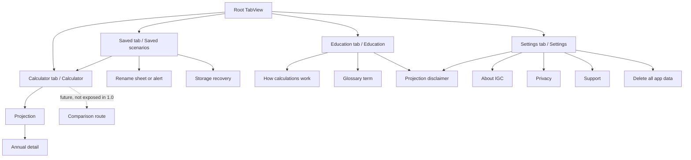

# Investment Growth Calculator native design system

Status: Ready for Product Manager review
Task: IGC-005 — iOS
Date: 2026-07-28
Applies to: Native iOS 1.0, minimum iOS 17
Scope: Documentation and interaction specification only; no iOS implementation or
final brand, legal, privacy, support, or App Store asset

## 1. Authority, intent, and non-goals

This specification translates the accepted IGC product and native architecture into
an implementation-ready SwiftUI hierarchy. It does not change the calculation,
validation, preset, target, scenario, persistence, or platform-scope contracts.

The following markers distinguish authority:

- **Accepted** — already fixed by `docs/PRODUCT_SPEC.md`,
  `docs/CALCULATION_SPEC.md`, `docs/SCENARIO_SCHEMA.md`, `DECISIONS.md`, or
  `docs/IOS_ARCHITECTURE.md`. IGC-005 does not reopen it.
- **Apple guidance** — current platform guidance checked on 2026-07-28. It informs
  design but is not, by itself, evidence of App Review or accessibility conformance.
- **Design specification** — the recommended native behaviour to implement after this
  document is accepted.
- **PM review** — a proposed product/design choice that becomes binding only after the
  Product Manager accepts it.
- **QA evidence** — behaviour IGC-006 must turn into reproducible checks. This document
  states intent; it does not claim that an unbuilt app passes.
- **App Store review** — wording or release behaviour IGC-008 must verify against
  current policy and product metadata.

Apple recommends system text styles and layouts that adapt through the larger
accessibility sizes, system colours, non-colour cues, labelled page hierarchy, and
adequate targets. Direct guidance is available for
[typography and Dynamic Type](https://developer.apple.com/design/human-interface-guidelines/typography),
[accessibility and contrast](https://developer.apple.com/design/human-interface-guidelines/accessibility),
[VoiceOver](https://developer.apple.com/design/human-interface-guidelines/voiceover),
[tab bars](https://developer.apple.com/design/human-interface-guidelines/tab-bars),
[data entry](https://developer.apple.com/design/human-interface-guidelines/entering-data),
[charts](https://developer.apple.com/design/human-interface-guidelines/charts), and
[motion](https://developer.apple.com/design/human-interface-guidelines/motion).
No time-sensitive Apple submission requirement is asserted here; IGC-008 owns that
verification. Statements labelled Apple guidance are recommendations, while the
accepted iOS 17 minimum and native product scope remain product requirements.

This document does not:

- create an app, Xcode project, Swift source, asset catalogue, icon, screenshot,
  prototype, or final artwork;
- design comparison, monthly native detail, export, sync, accounts, payments,
  premium states, analytics, remote content, or a backend;
- make calculations or persisted scenarios into advice, a forecast, or a live
  investment product;
- select final legal, privacy, support, or App Store copy; or
- certify accessibility, contrast, privacy, or App Store compliance.

## 2. Design thesis and product hierarchy

### 2.1 Thesis

IGC is a calm educational instrument, not a trading dashboard. The interface should
help a person set assumptions, inspect one projection, understand why nominal and
today-value amounts differ, and preserve useful scenarios without implying certainty.

Five principles govern the design:

1. **Assumptions before authority.** Always show that the output follows the person's
   inputs. Do not use predictive language, market imagery, live-price conventions, or
   celebratory returns.
2. **One answer, then context.** Lead with final balance after fees, then today-value
   context, target status, composition, fee impact, chart, and annual detail.
3. **Precision without false certainty.** Format monetary results consistently to two
   decimal places as required, while copy says “projection”, “assumed”, and “could”;
   avoid probability claims or confidence bands the model does not calculate.
4. **Native by default.** Prefer `TabView`, `NavigationStack`, `Form`, `Section`,
   `TextField`, `Picker`, `Button`, `Menu`, `DisclosureGroup`, `List`, `Chart`,
   `Alert`, and `confirmationDialog` before custom controls.
5. **The same fact in more than one form.** Status uses text plus symbol, chart series
   use line treatment plus colour and labels, and every chart has a text summary and
   annual-data route.

### 2.2 Information priority

The visual and reading hierarchy is:

1. **Primary action:** enter or revise assumptions, then select **View projection**.
2. **Assumptions:** the values, preset/Custom state, duration, and timing that define
   the calculation.
3. **Outcome:** **Final balance after fees** as the primary KPI.
4. **Context:** today-value equivalent, before-fee amount, contributions, growth, fees,
   and optional target status.
5. **Evidence:** accessible growth chart and annual detail.
6. **Education:** plain-language definitions, methodology, exclusions, and disclaimer.

Brand must not outrank the financial hierarchy. Use `IGC` in the app identity and
About screen, the public name in first-launch/About copy, and one restrained accent
colour. Do not repeat a large logo on calculation or result screens.

### 2.3 Projection, not advice or forecast

The distinction is structural, not a footer-only disclaimer:

- Calculator introduction: “Explore an illustrative projection using your
  assumptions.” **Draft — PM/App Store review.**
- Results navigation title: **Projection**, not “Forecast”, “Plan”, “Portfolio”, or
  “Recommendation”. **PM review DS-03.**
- KPI label: **Final balance after fees**, followed by the selected duration.
- Result context: “Based on constant rates and contributions.”
- Education and Results each expose the projection disclaimer and exclusions.
- Presets are labelled examples, never “recommended”, “best”, “safe”, or risk-rated.
- Positive target status is “Above target”, not “Success”, “On track”, or “Goal
  achieved”; negative status is “Below target”, not “Failure”.

### 2.4 PWA translation

| PWA evidence | Native treatment | Rationale |
| --- | --- | --- |
| After-fee final balance leads | **Preserve** | Accepted primary KPI. |
| Explicit inputs, presets, target, fee and inflation context | **Preserve** | Useful product identity and shared semantics. |
| Local saved scenarios | **Preserve and expand to accepted native CRUD** | Native 1.0 supports multiple local scenarios. |
| Assumptions, methodology, glossary | **Preserve as Education routes and contextual links** | Makes dense content findable without hiding it in tooltips. |
| Indigo accent, quiet cards, light/dark appearance | **Adapt semantically** | Keep recognition, use system colours/materials and Dynamic Type. |
| One responsive page with sticky form and dense result dashboard | **Reject for native** | Tabs and stacks create a clearer small-screen hierarchy. |
| Results recalculate after a debounce | **Adapt to explicit View projection** | Prevents route churn, invalid intermediate outputs, and VoiceOver noise. **PM review DS-02.** |
| Four chart lines and visual-only chart | **Reduce to two primary series and add summary/data alternatives** | Improves legibility and fixes the audited accessibility risk. |
| Monthly table, CSV and scenario comparison | **Reject in native 1.0** | Explicit accepted platform difference. |
| Custom web toggles, modal glossary and inline two-step delete | **Replace with system controls/routes/dialogs** | Native behaviour and assistive-technology support. |
| Optional mobile quick-start card | **Adapt to one non-blocking coach card** | Keeps immediate calculator access. **PM review DS-01.** |
| Disabled browser zoom | **Do not reproduce** | Native layout must scale through accessibility sizes. |

## 3. Information architecture and navigation

### 3.1 Top-level structure

**Accepted:** four stable tabs, each with its own `NavigationStack`.

| Feature name | Tab label | SF Symbol | Root navigation title |
| --- | --- | --- | --- |
| Calculator | Calculator | `function` | Calculator |
| Saved scenarios | Saved | `bookmark` / `bookmark.fill` | Saved scenarios |
| Education | Education | `book.closed` / `book.closed.fill` | Education |
| Settings/About | Settings | `gearshape` / `gearshape.fill` | Settings |

“Saved” is the shorter tab label; “Saved scenarios” remains the screen title. All four
tabs remain visible even when Saved scenarios is empty or storage is unavailable.
Apple guidance describes tab bars as stable top-level navigation whose sections retain
their navigation state and recommends labels and SF Symbols
([Tab bars](https://developer.apple.com/design/human-interface-guidelines/tab-bars)).

The dotted comparison route is a reserved typed route only. It has no tab, button,
selection affordance, locked row, empty state, copy, or destination view in 1.0.

### 3.2 Route and state rules

- Each tab preserves its stack and scroll position while switching tabs during the app
  session. Calculator draft text, field focus after keyboard dismissal, optional-target
  disclosure, and the last validated projection snapshot are feature-local state.
- Returning from Projection restores Calculator content and scroll position. Returning
  from Annual detail restores Projection, including chart-series visibility.
- System back navigation uses the navigation-bar back button and interactive swipe.
  Do not add duplicate in-content Back or Close buttons to pushed screens.
- Deep titles are unique: **Projection**, **Annual detail**, **How calculations work**,
  each glossary term, **Projection disclaimer**, **About IGC**, and **Privacy**.
- Loading a saved scenario copies its values, target, and truthful preset state into
  Calculator; selects the Calculator tab; pops that stack to its root; moves focus to
  the loaded-status heading; and does not mutate the saved record.
- Loading does not automatically push Projection. The person reviews the assumptions
  and selects **View projection**. **PM review DS-04.**
- A new projection replaces the previous result snapshot only after validation passes.
  It pushes one Projection route; repeated taps must not stack duplicate Projection
  routes.
- Scene restoration beyond ordinary in-session tab state is not required for 1.0.
  Saved scenarios, appearance, and onboarding state persist as accepted; unsaved draft
  restoration after process termination is an open enhancement, not a requirement.

## 4. Screen-by-screen specification

The order listed for each screen is both the default visual order and VoiceOver swipe
order unless an explicit grouping rule says otherwise.

### 4.1 First launch / coach card

| Item | Specification |
| --- | --- |
| Purpose / question | Explain the first useful action without blocking the accepted Custom example: “How do I start?” |
| Hierarchy | Calculator title; draft projection statement; coach-card heading **Start with the example**; one-sentence explanation that the example is Custom; **Choose a preset** and **Dismiss**; form. |
| Actions | **Choose a preset** dismisses the card and focuses/scrolls to the Preset picker without selecting anything. **Dismiss** permanently records dismissal. |
| Navigation | Inline at Calculator root; never a required sheet, carousel, permission prompt, or separate route. It appears once on first launch only. |
| Adaptive | Full-width inside the readable form column. Actions are horizontal only when both labels fit at current Dynamic Type; otherwise vertical. |
| VoiceOver | Heading, explanation, Choose a preset, Dismiss. Moving to the picker posts one layout/focus change, not a promotional announcement. |
| Dynamic Type | Unlimited system scaling; card grows vertically and scrolls with the form. |
| Failure / recovery | If onboarding preference cannot be written, dismiss for the current session and do not block calculation. |
| Architecture | Calculator feature owns presentation state; persistence stores only the accepted onboarding preference, not calculation data. |

**Design specification / PM review DS-01:** retain this one non-blocking coach card.
Do not reproduce the PWA’s viewport or saved-scenario eligibility rules; the native
card appears once, is always optional, and leaves the initial Custom values untouched.

### 4.2 Calculator

| Item | Specification |
| --- | --- |
| Purpose / question | Set assumptions and answer: “What might this amount become?” |
| Hierarchy | Navigation title; draft projection statement; loaded-scenario status when relevant; Preset; Investment; Growth and costs; Duration and timing; Target disclosure; primary **View projection**; draft disclaimer link; overflow **Reset calculator**. |
| Primary action | **View projection** validates all fields and pushes Projection with an immutable validated snapshot. |
| Secondary actions | Open term education from help links; add/remove target; reset to accepted Custom example after confirmation if edited. |
| Navigation | Root of Calculator stack. Back from Projection returns here. No result dashboard is embedded in the form. |
| Compact | One scroll column, 16-point horizontal margins; paired fields stack when labels or values do not fit. |
| Expanded | Centred readable column, recommended maximum 720 points. At standard type and sufficient width, paired values may use a two-column `Grid`; section and focus order remain leading-to-trailing then top-to-bottom. |
| VoiceOver | Title; intro; status; section headings; each label/value/helper/error as one logical field group; target disclosure; primary action; disclaimer. |
| Dynamic Type | `Form`/`ScrollView` grows without fixed section heights. At accessibility sizes every field, picker, and button takes its own row. |
| Empty / invalid | Calculator is never empty. Invalid fields retain drafts, show inline messages, and prevent navigation; the first invalid field receives focus on primary-action failure. |
| Architecture | `Features/Calculator` owns draft strings, focus, disclosure, preset presentation, and validation state. Canonical validation remains in `Core/Domain`; formatters remain in `Core/Presentation`. |

### 4.3 Optional target

| Item | Specification |
| --- | --- |
| Purpose / question | Add an optional today-value goal: “How does this projection compare with a target in today’s money?” |
| Hierarchy | Disclosure button **Target in today’s money (optional)**; explanatory text; GBP field; **Remove target** when a value exists. |
| Actions | Expand/collapse; enter a non-negative target; remove clears the draft and collapses after confirmation only when an edited non-empty value would be lost. |
| Navigation | Remains inside Calculator; a contextual **What is today’s money?** link opens the Education glossary route. |
| Adaptive / Dynamic Type | Same single-row-to-stacked rules as form fields; never hide helper copy behind an info icon or tooltip. |
| VoiceOver | Disclosure exposes expanded/collapsed state. Field label includes “optional”; value is spoken as pounds. Remove target has the target value in its hint. |
| Invalid | Invalid non-empty target is an error; it never silently removes target analysis. Blank means absent and zero is a valid present target. |
| Architecture | Draft is Calculator state; validated `targetToday` stays outside the growth engine and enters target analysis only. |

### 4.4 Projection

| Item | Specification |
| --- | --- |
| Purpose / question | Answer: “What does this scenario project, and what explains the result?” |
| Hierarchy | Title **Projection**; short assumptions line and draft disclaimer; KPI card; today-value context; target status if set; value composition; fee impact; chart text summary; chart; **View annual detail**; assumptions summary; disclaimer link. |
| Primary action | The outcome is the purpose; no artificial action outranks it. The main next-step button is **View annual detail**. |
| Secondary actions | Toolbar **Save** for an unsaved snapshot or **Save as new** for a loaded scenario; back to edit; chart-series visibility; education links. |
| Navigation | Pushed from Calculator. Annual detail pushes from here. Back does not discard Calculator drafts. |
| Compact | One column; all values occupy a dedicated line below their label if necessary. |
| Expanded | Centred maximum 840-point content. KPI/context may form two visual columns at standard Dynamic Type; accessibility order remains KPI then context. Chart uses full readable width. |
| VoiceOver | Title; disclaimer context; KPI group; target group; composition/fees groups; chart summary; chart exploration; annual-detail action; assumptions; disclaimer link. Decorative card backgrounds and icons are hidden. |
| Dynamic Type | No fixed card heights. Amounts never truncate. At accessibility sizes, chart legend becomes a vertical list and chart may follow the text summary on its own section. |
| Error / recovery | Results come only from a validated snapshot. If an unexpected calculation failure occurs, replace all numbers with an error state: **Projection unavailable**, **Return to calculator**; never show partial or stale values as current. |
| Architecture | `Features/Results` owns the snapshot and presentation state. `Core/Calculation` returns raw values; `Core/Presentation` formats, builds chart series, and creates factual summary values. |

### 4.5 Accessible growth visualisation

| Item | Specification |
| --- | --- |
| Purpose / question | Supplement the KPI: “How does the balance change over the selected period?” |
| Hierarchy | Heading **Balance over time**; factual text summary; visible legend; line chart; **View annual detail**. |
| Series | Default two: **After fees** (solid line, circle marks at annual points, brand accent) and **After fees in today’s money** (dashed line, diamond marks, secondary chart colour). |
| Actions | Each series has a labelled `Toggle`; at least one must remain visible. Scrubbing annual points is optional enhancement, never required to reveal a value. |
| VoiceOver | Chart title and summary precede the chart. Use Swift Charts accessibility/audio-graph support; each annual point identifies year, series, and full GBP value. Do not expose redundant axis tick labels. Annual detail is the complete tabular alternative. |
| Dynamic Type | Summary and legend scale. Plot height may increase from 240 to 320 points, but does not consume the whole viewport. At AX sizes the annual alternative remains immediately after the chart. |
| Empty / failure | A valid duration always yields at least one annual point. If Chart cannot render, keep the summary and annual-detail action; do not replace them with a spinner. |
| Architecture | Annual rows from `Core/Calculation` are projected in `Core/Presentation`; chart values are not calculation evidence and do not round-trip into domain data. |

Apple advises summarising a chart’s main message, not relying on interaction for
critical information, giving chart elements useful accessibility descriptions, and
using more than colour to distinguish data
([Charts](https://developer.apple.com/design/human-interface-guidelines/charts)).
Swift Charts’ audio-graph behaviour supplements but does not replace the text summary
and annual route.

### 4.6 Annual detail

| Item | Specification |
| --- | --- |
| Purpose / question | Provide a complete nonvisual and visual annual account: “What happens each year?” |
| Hierarchy | Title; view picker; definition of selected view; annual rows in chronological order; final total/context summary; assumptions link. |
| Views | Menu-style picker, default **After fees**; alternatives **Before fees**, **After fees in today’s money**, and **Before fees in today’s money**. Do not use “real” without the visible “today’s money” explanation. |
| Annual row | Collapsed row: **Year N** or **Year N (partial)** and closing balance. Expanded detail: opening balance, contributions, growth or fees as defined by the selected view, and closing balance. Values follow the accepted annual contract. |
| Actions | Change view; expand/collapse a row; **Expand all** is omitted in 1.0 to avoid a very long accidental state. |
| Navigation | Pushed from Projection; title remains visible; back returns to the same Projection state. |
| Compact | Disclosure list, never a squeezed five-column table or mandatory horizontal scroll. |
| Expanded | At sufficient width and non-accessibility type sizes, render semantic table columns with a sticky header. Row content and labels remain identical to compact disclosure content. |
| VoiceOver | View picker label/value/hint; each collapsed row is one button announcing year, partial-year status, closing label and amount, expanded state; expanded facts follow. Add a **Years** custom rotor only if user testing shows benefit; headings rotor is required. |
| Dynamic Type | Always use disclosure rows at accessibility sizes, even on iPad. Full values wrap rather than truncate. |
| Empty / failure | Valid calculation has annual rows. Missing/mismatched rows are a calculation error, not an empty list. Return to Calculator and do not synthesise rows. |
| Architecture | `Features/Results/AnnualDetail`; uses immutable annual rows. Monthly rows and export controls have no native 1.0 presentation. |

### 4.7 Saved scenarios

| Item | Specification |
| --- | --- |
| Purpose / question | Answer: “Which projections have I saved on this device, and which one should I load?” |
| Hierarchy | Title; storage/recovery status if any; scenario count; list sorted by most recently updated; empty state; footer explaining local storage; no comparison selection. |
| Scenario row | Name; **Custom** or preset display name; starting balance; contribution and frequency; growth rate; duration; updated date. Whole row loads; trailing `Menu` exposes Rename, Duplicate, Delete. |
| Actions | Load; Rename; Duplicate; Delete. **Save** begins from a validated Projection snapshot, not this empty list. Reset all lives in Settings, not the row menu. |
| Navigation | Root of Saved stack. Load selects Calculator and pops it to root. Mutation sheets/dialogs dismiss back to the same list position. |
| Compact | Standard `List`; metadata wraps to at most logical lines, not an ellipsis-only summary. |
| Expanded | Centred list maximum 840 points. Do not introduce folders, sidebars, detail inspectors, or comparison columns. |
| VoiceOver | Row label: name, preset/Custom, principal, contribution frequency, growth rate, duration, last updated. Hint: “Loads into Calculator.” Custom actions mirror Rename, Duplicate, Delete; the trailing menu remains reachable. |
| Dynamic Type | Row height expands. At accessibility sizes metadata becomes labelled vertical facts; menu target remains at least 44 points. |
| Empty | `bookmark` symbol decorative; heading **No saved scenarios**; “View a projection, then choose Save.”; button **Go to Calculator**. |
| Error / recovery | Storage unavailable, corrupt, and unsupported states use the recovery specifications in 4.10 and never masquerade as an empty list. |
| Architecture | `Features/SavedScenarios` awaits `ScenarioStore` snapshots/mutations and never reaches the file system directly. |

**Design specification / PM review DS-05:** sort descending by `updatedAt`, then
`createdAt`, then stable `id`. Loading does not update timestamps because it is not a
record mutation.

### 4.8 Save, rename, duplicate, load, and delete

#### Save

1. From Projection, select toolbar **Save**.
2. Present a system sheet at large Dynamic Type or alert-style name entry where it
   remains usable with the keyboard. Title: **Save scenario**.
3. Name field is prefilled with a non-authoritative working suggestion such as
   “15-year projection”; the person may replace it. **PM review of suggestion copy.**
4. Trim on commit; require a non-empty completed name that passes the authoritative
   scenario-V1 JSON Schema name rules, including `maxLength: 120`. Show the error below
   the field and keep the sheet open.
5. On success, dismiss and show persistent-enough inline status **Saved “[name]”** on
   Projection. On failure, keep input and offer **Try again** and **Cancel**.

Saving always creates a new UUID and timestamps from the validated result snapshot.
It never overwrites merely because a loaded scenario is active. Native 1.0 uses
**Save as new** after loading to avoid an unspecified update/overwrite flow.

#### Rename

- Row menu **Rename** opens name entry prefilled with the current name.
- Apply the same trim/length rules. Preserve ID and `createdAt`; update only name and
  `updatedAt` after successful atomic persistence.
- Success status: **Renamed to “[name]”**. Failure retains the draft.

#### Duplicate

- Row menu **Duplicate** performs one mutation with no confirmation.
- Name algorithm: append “ copy”; if occupied, append “ copy 2”, “ copy 3”, and so on.
  Truncate the original without splitting an extended grapheme cluster, then validate
  the completed candidate — including its suffix — against the authoritative
  `shared/schemas/scenario-v1.schema.json` name rules, including `maxLength: 120`.
  Swift `String.count` or a grapheme count may guide safe truncation but does not, by
  itself, define or prove the portable schema limit. If the candidate fails, remove
  another complete grapheme cluster and revalidate; do not persist until the completed
  name conforms.
- Preserve all scenario values and truthful `presetId`; create a new UUID and both new
  timestamps. Status: **Created “[duplicate name]”**.

#### Load

- Whole-row activation loads; menu also offers **Load** for discoverability.
- First validate the saved record against V1 structural and semantic rules. If it
  otherwise validates but its persisted `presetId` does not match all
  preset-controlled values, copy the inputs and target into Calculator and present the
  draft as Custom. Do not modify the saved record or its persisted `presetId`.
- A preset mismatch alone is not corrupt or unsupported data and does not enter
  recovery. Use recovery only when the record otherwise fails V1 structural or
  semantic validation.
- Select Calculator, pop to root, focus an inline heading/status:
  **Loaded “[name]”**. Helper text: “Review the assumptions, then view the projection.”
- Loading never changes the saved record. A load failure stays in Saved and offers
  **Try again**; do not place partial fields in Calculator.

#### Delete one

- Row menu destructive action opens a confirmation dialog:
  **Delete “[name]”?**
  “This removes the saved scenario from this device. This can’t be undone.”
  **Draft — App Store/privacy review.**
- Buttons: **Delete scenario** (destructive), **Cancel**.
- Confirm only after the exact ID still resolves. On success remove the row and show
  **Deleted “[name]”**. On failure keep the row and show **Couldn’t delete “[name]”**
  with **Try again**.

Swipe-to-delete may supplement the menu, but never be the only route. It opens the same
confirmation rather than deleting immediately.

### 4.9 Education, glossary, and assumptions

| Item | Specification |
| --- | --- |
| Purpose / question | Explain terms, model behaviour, and exclusions without interrupting calculation. |
| Hierarchy | Title; search is unnecessary for the small 1.0 set; **Understanding your projection**; **How calculations work**; **Glossary**; **What this projection excludes**; **Projection disclaimer**. |
| Glossary order | Annual growth rate (APR); Compounding; Inflation; Annual fee; After fees; Today’s money / purchasing power; Contribution frequency; Contribution timing; Preset and Custom; Target. |
| Actions | Rows push plain-language articles. Calculator/Projection contextual links deep-link to the relevant article inside the Education stack, while the selected top-level tab remains the originating tab until the person explicitly switches tabs. Implement as a local sheet or pushed route in the current stack rather than secretly switching tabs. |
| Compact / expanded | Centred `List` or grouped content up to 720 points; no modal web-style glossary. |
| VoiceOver | Page titles and article section headings carry heading traits and rotor navigation. Equations, if shown, need a plain-language accessibility label. |
| Dynamic Type | Full article scroll, comfortable line length, no clipped accordions. `DisclosureGroup` may summarise exclusions but visible critical disclaimer text is not collapsed by default. |
| Empty / failure | Bundled content is always available offline. Missing content is a build defect, not a network/loading state. |
| Architecture | `Features/Education`; static bundled copy. Shared meaning stays aligned to the contract. No remote content or live rates. |

Contextual education does not use unlabeled `?` icons, hover-only tooltips, or content
available solely to VoiceOver. Apple advises using accurate titles/headings and
describing key elements for VoiceOver
([VoiceOver](https://developer.apple.com/design/human-interface-guidelines/voiceover)).

### 4.10 Settings/About and data recovery

| Item | Specification |
| --- | --- |
| Purpose / question | Manage appearance and local app data; find product, privacy, support, and disclaimer information. |
| Hierarchy | **Appearance**; **Data on this device**; **About and help**. |
| Appearance | Picker: **System** (default), **Light**, **Dark**. Do not add brand themes. |
| Data | Explanatory row about local scenarios; destructive **Delete all app data** separated in its own section. |
| About/help | About IGC; Privacy; Support; Projection disclaimer; app version/build in About. |
| Navigation | Root Settings list; rows push unique titled screens. External Privacy/Support URLs use `Link` only after IGC-008 supplies valid release URLs; otherwise bundled informational pages must remain useful and no broken row ships. |
| Adaptive | Standard centred Settings form/list; never a bespoke iPad preferences window. |
| VoiceOver | Section headings; row label/value/“button”; version read as one fact; destructive action explicitly says “all app data”. |
| Dynamic Type | Standard wrapping rows; URLs have descriptive labels, not raw addresses. |
| Failure | Appearance-write failure keeps the active in-session appearance and reports it was not saved. Data-reset failure never claims deletion. |
| Architecture | `Features/Settings`; preferences and ScenarioStore are injected. No account, iCloud, App Group, analytics, or network state. |

#### Delete all app data

Use a separate confirmation from deleting one scenario:

- Title: **Delete all app data?**
- Working body: “This deletes saved scenarios and resets appearance, onboarding, and
  calculator state on this device. This can’t be undone. Device backups have their own
  lifecycle.” **Draft — PM/IGC-008 must approve backup and deletion wording.**
- Buttons: **Delete all app data** (destructive), **Cancel**.
- After successful store and preference reset, restore the accepted Custom initial
  calculator values, clear navigation snapshots, choose Calculator, and announce
  **All app data deleted**.
- If any part fails, do not show success or clear the UI optimistically. Re-read stores,
  report what remains unknown, and offer **Try again**. IGC-006 must define atomicity or
  partial-failure expectations with the engineer.

#### Storage unavailable

- Saved shows an error banner and recovery content, not an empty state:
  **Saved scenarios are temporarily unavailable**.
- Body: “The calculator still works, but scenarios can’t be loaded or saved right now.”
- Actions: **Try again**; **Continue with calculator**.
- Existing unread data is preserved. Save actions explain unavailability rather than
  silently failing or queueing.

#### Corrupt data

- Saved root becomes a recovery state:
  **Saved scenarios need recovery**.
- Explain that the app could not read the saved data and retained a recovery copy where
  practical. Do not claim it can be repaired unless a repair path exists.
- Actions: **Try again**, **Continue without saved scenarios**, and destructive
  **Start with an empty saved list**.
- Continuing without saved scenarios is session-only and does not overwrite the file.
  Starting empty requires a second confirmation and succeeds only after the unreadable
  document is preserved under the architecture’s recovery policy.

#### Unsupported schema

- Distinct heading: **Saved scenarios use a newer format**.
- Explain that this app version cannot open them. Do not partially decode them as V1.
- Actions: **Keep data and continue**, **Try again** after an app update only when one
  is actually available through normal App Store lifecycle, and destructive
  **Delete saved scenarios**.
- Do not invent import, export, migration, account, sync, or support-upload flows.

### 4.11 Empty, invalid, and destructive states

- Empty Saved scenarios is encouraging but neutral; it does not promote comparison.
- Invalid Calculator keeps all drafts, places errors adjacent to fields, summarises only
  after a failed primary action, and never shows a stale result as current.
- Unavailable storage affects Saved and saving, not local calculation.
- Corrupt and unsupported records are preservation/recovery states, not ordinary
  emptiness.
- Destructive confirmation names the exact record or “all app data”, describes scope,
  uses a destructive button role, defaults focus away from destruction, and always has
  Cancel.

## 5. Calculator form and input behaviour

### 5.1 Control map

| Value | Visible label | Native control | Keyboard / values | Helper and unit |
| --- | --- | --- | --- | --- |
| `presetId` | Preset | `Picker` with menu style | Custom plus four curated presets | “Presets update growth, inflation, fee and compounding.” |
| `principal` | Starting balance | Text field in labelled row | Decimal pad; GBP string draft | Visible `£`; “Amount invested now.” |
| `contribution` | Regular contribution | Text field | Decimal pad; GBP string draft | Visible `£`; frequency is adjacent or next row. |
| `contributionFrequency` | Contribution frequency | Menu picker | Weekly, Monthly, Annual | When Annual: “The model spreads this as an amount ÷ 12 each month.” |
| `apr` | Annual growth rate (APR) | Text field | Decimal pad; percent draft | Visible `%`; “Assumed yearly growth before fees and inflation.” |
| `inflationRate` | Inflation | Text field | Decimal pad; percent draft | Visible `%`; “Used for today’s-money values.” |
| `annualFeeRate` | Annual fee | Text field | Decimal pad; percent draft | Visible `%`; “Ongoing asset-based fee assumption.” |
| `compoundFrequency` | Compounding | Menu picker | Daily, Monthly, Quarterly, Annual | Context link to methodology. |
| `years` | Years | Text field | Number pad; integer | Combined duration error follows both duration fields. |
| `months` | Extra months | Menu picker preferred; number field acceptable | 0–11 | Menu avoids invalid extra-month values. |
| `timing` | Contribution timing | Two-option picker; segmented only when labels fit | Start of period, End of period | Plain-language helper beneath selection. |
| `targetToday` | Target in today’s money | Text field in optional disclosure | Decimal pad; non-negative GBP draft | Visible `£`; blank is absent, zero is present. |

Use choices instead of text entry where the option set is small, consistent with
Apple’s current [data-entry guidance](https://developer.apple.com/design/human-interface-guidelines/entering-data).
Do not force segmented controls when labels wrap; use a menu or inline picker at narrow
widths and accessibility sizes.

### 5.2 Parsing and draft rules

- Keep a string draft separate from canonical numbers. The person’s invalid or partial
  draft remains visible until corrected; never replace it with the last valid value.
- Use an `en_GB` numeric formatter for native entry. Currency fields may accept digits,
  one decimal separator, grouping commas/spaces, and a pasted `£` that the formatter
  can safely remove. Percent fields have a visible suffix, so a typed `%` is rejected
  with a field error rather than silently interpreted.
- Do not accept signs for non-negative fields, scientific notation, `NaN`, or infinity.
- Do not silently clamp, round, or coerce values. Calculations and persistence use raw
  canonical values; monetary results alone use the contract’s two-decimal display
  rule.
- Required money/rate/duration blanks are invalid. Blank optional inflation and fee
  commit to canonical zero as accepted. Blank target is absent; target zero is present.
- Formatting on focus loss may add grouping separators but must preserve the numeric
  value and user-entered precision. The `£`/`%` unit stays visually adjacent and is
  included in the accessibility value, not typed into the draft.

This is platform-specific parsing presentation and does not change canonical bounds or
units.

### 5.3 Focus, keyboard, and submission

- Use a typed `@FocusState` order matching visual order. A keyboard accessory provides
  **Previous**, **Next**, and **Done** because number/decimal pads have no reliable
  Return key.
- Next validates the current field without announcing a valid state, then moves to the
  next editable field. Done validates and dismisses the keyboard.
- Hardware Tab/Shift-Tab follows the same order. Return activates the focused primary
  button only when no text field is editing.
- Tapping outside may dismiss the keyboard but must not discard a draft or hide an
  unresolved error.
- **View projection** is the only calculation/navigation trigger. It parses and
  validates the whole draft, creates an immutable canonical snapshot, calculates
  synchronously, and pushes Projection. **PM review DS-02.**

### 5.4 Validation

All shared bounds and semantic rules are exact:

- principal and contribution: each 0 through £1,000,000,000; at least one greater than
  zero;
- APR: 0% through 999%;
- inflation: 0% through 20%;
- annual fee: 0% through 10%;
- whole years: integer 0 or more; extra months 0–11; total 1–720 months;
- target: optional and non-negative;
- numeric inputs: finite.

Validation timing:

1. While typing, allow plausible partial drafts such as blank or a trailing decimal;
   do not announce on every character.
2. On focus loss, validate the field and any combined rule it affects.
3. On View projection, validate all fields. If invalid, keep the route, scroll to and
   focus the first invalid field, and announce: “Can’t view projection. [count] fields
   need attention. [first error].”

An error appears directly below its control with
`exclamationmark.circle.fill` plus text; colour is supplementary. Associate it with the
field’s accessibility description. The principal/contribution combined error follows
the pair and is referenced by both. The duration error follows years/months and is
referenced by both. When a focused field becomes valid, remove the error without a
success announcement.

Suggested error templates preserve the accepted meaning:

- “Enter a starting balance from £0 to £1,000,000,000.”
- “Enter a regular contribution from £0 to £1,000,000,000.”
- “Starting balance and regular contribution can’t both be £0.”
- “Enter an annual growth rate from 0% to 999%.”
- “Enter inflation from 0% to 20%.”
- “Enter an annual fee from 0% to 10%.”
- “Enter a duration from 1 month to 60 years.”
- “Extra months must be from 0 to 11.”
- “Enter a target of £0 or more, or remove the target.”

IGC-006 must confirm exact field mapping against shared validation cases before these
become test snapshots.

### 5.5 Preset and Custom truthfulness

- Initial selection is **Custom**, with the accepted £10,000 / £250 monthly / 7% / 3% /
  0.20% / monthly / 15 years / start timing values. No preset row appears selected.
- Choosing a curated preset deliberately updates only APR, inflation, annual fee, and
  compounding. Global Index applies 0.40% only at this moment.
- Active preset persists only while all four controlled values match. Editing any one
  immediately changes the visible selection to Custom and announces once, after the
  edit commits: “Preset changed to Custom.”
- Editing principal, contribution, contribution frequency, duration, timing, or target
  does not clear a selected preset because those fields are not preset-controlled.
- Choosing **Custom** while a preset is active clears `presetId` but retains the
  current values; it does not reset the form.
- Reset calculator restores the accepted Custom initial state, not Global Index.
- A loaded record displays its persisted preset only if its controlled fields still
  match. If the record otherwise passes V1 structural and semantic validation but
  those values do not match, present the Calculator draft as Custom without modifying
  the saved record or its persisted `presetId`. The mismatch alone is not corrupt or
  unsupported data and does not enter recovery.

The visible choices and controlled assumptions are:

| Visible name | Stable ID | APR | Inflation | Annual fee | Compounding |
| --- | --- | ---: | ---: | ---: | --- |
| Custom | `null` | Current entered value | Current entered value | Current entered value | Current entered value |
| Global Index (DIY) | `global-index-diy` | 7% | 3% | 0.40% | Monthly |
| Balanced portfolio | `balanced-portfolio` | 6% | 3% | 0.75% | Monthly |
| Equity-heavy portfolio | `equity-heavy-portfolio` | 9% | 3% | 1.00% | Monthly |
| Savings account | `savings-account` | 4% | 3% | 0% | Monthly |

Preset names are presentation copy; stable IDs carry contract identity. Final
capitalisation and descriptions require PM copy review, but the values and deliberate
selection behaviour are accepted and must not change.

## 6. Results and financial communication

### 6.1 Result hierarchy and labels

| Rank | Label | Presentation |
| --- | --- | --- |
| 1 | Final balance after fees | Primary KPI in full GBP, two decimals; duration adjacent in words. |
| 2 | In today’s money | Full GBP, two decimals; visible inflation assumption. |
| 3 | Target status | Above / Below / Equal to target, classified from the unrounded raw gap and shown with icon plus words. |
| 4 | Starting balance | Context row. |
| 5 | Contributions | Label **Regular contributions added**; value from accepted totals. |
| 6 | Growth after fees | Derived after-fee balance less capital, labelled plainly; IGC-006 verifies formula. |
| 7 | Balance before fees | Context row, not a second competing KPI. |
| 8 | Fee impact | Distinguish **Fees paid** from **Difference caused by fees**, because lost future growth can make them differ. |
| 9 | Balance over time | Text summary, two-series chart, annual alternative. |
| 10 | Assumptions / disclaimer | Always reachable and short context visible on screen. |

“Nominal” is acceptable in Education but not required as the first-facing label.
Prefer **future pounds** or **before inflation** beside **today’s money**, while
retaining precise definitions:

- **Final balance after fees** is nominal and includes fee drag.
- **Balance before fees** is the nominal no-fee path.
- **In today’s money** is inflation-adjusted at the horizon under the accepted model.
- **Fees paid** is cumulative nominal asset-based fees.
- **Difference caused by fees** is before-fee final minus after-fee final and can exceed
  fees paid due to lost future growth.

### 6.2 Number formatting

- Detailed GBP display uses `en_GB`, `GBP`, grouping, a pound sign, and exactly two
  decimal places with the contract’s halfway-away-from-zero rule.
- Percentages use two decimal places in result/assumption detail; form drafts are not
  padded while editing.
- Compact `£105.96K`/`£1.20M` formatting is allowed only on visual chart axes. Tooltips,
  summaries, VoiceOver, KPIs, rows, and annual detail use full values.
- Apply monospaced digits (`monospacedDigit`) to changing KPIs and aligned data values,
  not to prose. Expanded table columns use trailing alignment and tabular figures.
- Never abbreviate a full KPI or truncate with an ellipsis. Give it a dedicated line;
  allow a line break after the currency symbol for extreme values at accessibility
  sizes. VoiceOver receives the unbroken full currency value.
- Preserve negative signs in gap values, but pair them with **Above** or **Below** copy
  so sign interpretation is not required.

### 6.3 Target treatment

Compute the unrounded raw gap as:

`rawGap = finalBalanceAfterFeesReal - targetToday`

Classify status from the raw binary64 value before display formatting. No display
rounding or tolerance changes the state.

| State | Symbol | Heading | Required fact |
| --- | --- | --- | --- |
| `rawGap > 0` | `arrow.up.circle.fill` | Above target | “£X above the target in today’s money.” |
| `rawGap < 0` | `arrow.down.circle.fill` | Below target | “£X below the target in today’s money.” |
| `rawGap == 0` | `equal.circle.fill` | Equal to target | “Projected value equals the target in today’s money.” |

For a nonzero raw gap whose absolute value formats to £0.00 under the standard
two-decimal monetary formatter, do not display “£0.00 above/below”. Display **Less than
£0.01 above the target in today’s money** or **Less than £0.01 below the target in
today’s money**, preserving the raw sign. Individually formatted target and projection
amounts may appear equal to the penny; the status text remains truthful about the
nonzero raw difference.

No target-comparison tolerance is proposed by IGC-005. Adding one would change shared
target semantics and requires a separately proposed and accepted Shared decision.

Also show the target in today’s money and its nominal horizon equivalent. Green,
orange, or accent colour may reinforce status only after contrast testing; text and
symbol carry the meaning. Do not celebrate above-target projections or shame
below-target projections.

### 6.4 Uncertainty

IGC does not calculate probability or variable returns. Communicate uncertainty by:

- consistently saying **projection**, **assumption**, and **illustrative**;
- displaying the input assumptions near the result;
- stating constant-rate, constant-contribution, and model-exclusion context;
- avoiding market trend arrows, confidence percentages, risk scores, guaranteed
  language, or outcome celebrations; and
- linking directly to methodology and disclaimer from Projection.

The working disclaimer is in section 13 and requires PM/IGC-008 acceptance.

## 7. Saved-scenario system

### 7.1 List and naming

- Sort by most recently updated, with deterministic fallbacks in 4.7.
- Scenario names are trimmed and non-empty, and the completed persisted name must
  validate against the authoritative scenario-V1 JSON Schema, including
  `maxLength: 120`. Do not impose the PWA’s historical 80-character UI limit or treat
  Swift `String.count` alone as the portable length definition.
- Display preset name derived from stable ID; otherwise **Custom**. Do not persist the
  display name as identity.
- Metadata is sufficient to distinguish scenarios without opening comparison:
  starting balance; contribution amount/frequency; APR; duration; updated date.
- Do not display A/B labels, checkboxes, “compare”, selection limits, folders, tags,
  sharing, sync, cloud icons, account identity, or premium affordances.

### 7.2 Mutation feedback

Use a reusable inline `StatusBanner` directly below the navigation title/content
heading. It avoids an overlay toast covering tab or keyboard controls.

- Success uses `checkmark.circle` plus specific text and may dismiss visually after
  five seconds; it remains in the accessibility announcement queue once.
- Failure uses `exclamationmark.triangle` plus text and a persistent **Try again** when
  retry is meaningful.
- Loading uses a labelled `ProgressView` only for actual awaited persistence. Avoid a
  spinner for synchronous calculation or bundled Education content.
- Never announce success before the store returns and the feature reloads its snapshot.
- Do not queue failed saves for later; the local store has no sync or background upload.

### 7.3 Corrupt and unsupported records

The store snapshot is all-or-recovery under the accepted architecture. The UI must not
silently omit one unreadable record and present the remainder as complete unless a
future accepted migration policy explicitly supports per-record recovery.

Recovery design must preserve:

- the distinction between corrupt bytes and an unknown future `schemaVersion`;
- the distinction between an otherwise-valid preset mismatch, which loads as Custom,
  and a structural or semantic V1 failure, which enters recovery;
- the last readable document until atomic replacement succeeds;
- the recovery copy where practical;
- the person’s ability to calculate without scenarios; and
- a deliberate, separately confirmed deletion route.

## 8. Component inventory

| Component | Purpose and preferred SwiftUI base | Variants / states / anatomy | Accessibility and usage |
| --- | --- | --- | --- |
| App navigation | `TabView` with four labelled tabs | Selected/unselected; each owns `NavigationStack` | System tab semantics; never disable/hide a tab. |
| Screen/section header | Navigation title, `Section` header, text with heading trait | Large root title; inline deep title; section heading; optional one-line explanation | Heading rotor; unique title first on deep screens; no all-caps. |
| Currency field | `TextField` plus visible prefix in `LabeledContent`/custom field row | Resting, focused, edited, invalid, disabled only with explanation | One element or tight group: label, GBP value, helper/error. Prefix not separately focusable. |
| Percentage field | `TextField` plus `%` suffix | Same as currency; optional-zero fields | Speak “percent”; suffix hidden as duplicate only if value supplies unit. |
| Picker/menu | `Picker`, menu or navigation-link style | Selected, focused, invalid only for corrupted model | Label and selected value; use choices for finite enums. |
| Segmented control | `Picker(.segmented)` only when both options fit | Timing at standard widths; menu/inline fallback | Never truncate labels; selected state is spoken by system. |
| Preset / Custom selector | Menu-style `Picker` | Custom, four presets, applied-status feedback | Custom is a real visible state; no pseudo-selected default. |
| Optional disclosure | `DisclosureGroup` or Button with disclosure state | Collapsed, expanded, edited value present | Label includes “optional”; expose expanded state; preserve entered value when collapsed. |
| Primary button | `Button(.borderedProminent)` | Enabled, pressed, focused, loading, disabled with nearby reason | One prominent action per decision surface; minimum 44×44-point hit region. |
| Secondary button | `Button(.bordered)` or plain toolbar button | Enabled/pressed/focused | Label describes action; icon supplements text. |
| Destructive button | Destructive role/system red | Menu action, confirmation action, loading/failure | Never colour-only; exact target in dialog; Cancel available and safer focus. |
| KPI result card | Custom layout using system background | Normal; target follows separately; unavailable replaces values | Group label, value, duration, today-money context in deliberate reading order. No fixed height. |
| Assumption/context row | `LabeledContent` | Standard, explanatory, link to Education | Label then full value; do not combine unrelated facts into one long element. |
| Target status | Custom system-symbol/text group | Above, below, equal | Symbol + heading + signed fact; group as one summary, facts accessible as children when needed. |
| Growth chart | Swift Charts `Chart` | Two series; one-series visible; render failure | Text summary first; audio graph/mark labels; line style, mark shape and text legend supplement colour. |
| Annual data row | `DisclosureGroup`; table at expanded width | Collapsed/expanded; partial year; four view modes | Year, partial status, closing value, expanded state; full labelled facts inside. |
| Scenario row | `Button`-like list row plus `Menu` | Resting, loaded status, mutation pending/failure | Whole row Load hint; custom actions mirror menu; no swipe-only action. |
| Empty state | `ContentUnavailableView` or semantic stack | Saved empty only | Symbol decorative; heading, explanation, one action. |
| Error/recovery banner | Custom semantic banner using system colours | Inline error, storage unavailable, corrupt, unsupported | Icon + heading + explanation + actions; announce once; focus on blocking recovery. |
| Confirmation dialog | `confirmationDialog` / `Alert` | Delete one; delete all; reset calculator | Name scope and irreversibility; destructive role; Cancel; no ambiguous “Yes”. |
| Status feedback | Inline `StatusBanner` | Success, failure, progress | Specific message; announcement; does not cover content; failure persists. |
| Glossary/education disclosure | Navigation row and article, optional `DisclosureGroup` | List term; full article; contextual deep link | Heading hierarchy; visible definitions; no tooltip-only content. |

Custom components are justified only for the KPI, target status, chart shell, status
banner, and recovery banner because standard components do not express their financial
grouping. They still use system text styles, colours, symbols, focus, button roles, and
accessibility APIs.

Apple’s current button guidance calls for a hit region of at least 44×44 points
([Buttons](https://developer.apple.com/design/human-interface-guidelines/buttons));
IGC applies that minimum to all interactive targets, including disclosure chevrons,
menus, chart controls, and inline links.

## 9. Visual foundations

### 9.1 Semantic colour roles

Use system-adaptive colours wherever possible. A custom brand accent requires named
light, dark, increased-contrast, and differentiated-without-colour review before
implementation.

| Token | Intent | Light/dark implementation direction |
| --- | --- | --- |
| `color.canvas` | Root grouped background | `systemGroupedBackground` |
| `color.surface` | Forms/lists/cards | `secondarySystemGroupedBackground` or `systemBackground` according to container |
| `color.surfaceRaised` | KPI emphasis | `systemBackground`; border provides separation |
| `color.textPrimary` | Main labels/values | `.primary` |
| `color.textSecondary` | Context/helper | `.secondary` |
| `color.separator` | Dividers/borders | system separator |
| `color.accent` | Primary action, selected navigation, after-fee chart | restrained IGC indigo semantic asset; exact values deferred to visual/contrast QA |
| `color.positive` | Above-target reinforcement | system green, never without arrow/text |
| `color.warning` | Below-target or recoverable warning reinforcement | system orange, never without symbol/text |
| `color.destructive` | Delete actions/errors | system red, with label/symbol |
| `color.chartAfterFee` | Solid after-fee series | accent |
| `color.chartTodayMoney` | Dashed today-money series | system teal/blue semantic choice, validated against surface and accent |
| `color.focus` | Keyboard/accessibility focus | system focus/accent behaviour; do not replace system indicator |

Apple recommends system-defined colours, checking contrast in light and dark
appearances, and not relying on colour alone
([Accessibility](https://developer.apple.com/design/human-interface-guidelines/accessibility),
[Color](https://developer.apple.com/design/human-interface-guidelines/color)).

**QA target, not current evidence:** Accessibility Inspector uses WCAG AA guidance of
4.5:1 for text up to 17 points, 3:1 for 18-point text, and 3:1 for bold text. IGC-006
must measure every custom foreground/background combination in light, dark, and
Increase Contrast; no token in this unbuilt system is claimed conformant.

### 9.2 Typography

Use the system font and semantic Dynamic Type styles:

| Role | Text style |
| --- | --- |
| Root screen title | Navigation large title |
| Deep screen title | Navigation inline title |
| KPI value | `largeTitle.bold()` with monospaced digits |
| KPI label / section title | `headline` |
| Article heading | `title2` or `title3` by level |
| Body / field label / primary copy | `body` |
| Helper / metadata | `subheadline` |
| Disclaimer / tertiary context | `footnote`, never hidden or ultra-light |
| Data values | Matching row style plus monospaced digits |

Do not cap `dynamicTypeSize`, embed fonts, use fixed point sizes, or depend on
`minimumScaleFactor` to make core content fit. Apple states that system text styles
support Dynamic Type and larger accessibility sizes and recommends preserving useful
content rather than truncating it
([Typography](https://developer.apple.com/design/human-interface-guidelines/typography)).

### 9.3 Spacing and layout

Use a small layout scale, not a token framework:

- `space.1` 4 points — icon/text optical adjustment only;
- `space.2` 8 points — tight label/helper relationship;
- `space.3` 12 points — related controls and row padding;
- `space.4` 16 points — standard screen margin and card padding;
- `space.6` 24 points — section separation;
- `space.8` 32 points — major content groups.

Use safe areas. Standard horizontal content margin is 16 points on compact widths and
24–32 points inside centred regular-width content. Long prose is capped near a
comfortable readable measure (approximately 640–720 points), not stretched edge to
edge.

### 9.4 Shape, border, divider, and elevation

- Let system controls choose their platform corner treatment.
- Custom KPI/status/recovery cards use a 16-point continuous corner radius, 16-point
  padding, and a one-pixel semantic separator border.
- Standard grouped sections need no additional card inside card.
- Use dividers to separate comparable facts; do not put every row in a floating tile.
- Elevation is minimal: no custom shadow by default. A subtle system shadow is reserved
  for temporary sheets/popovers, not result hierarchy.
- Respect Reduce Transparency by using opaque semantic surfaces; SwiftUI exposes the
  preference through
  [`accessibilityReduceTransparency`](https://developer.apple.com/documentation/swiftui/environmentvalues/accessibilityreducetransparency).

### 9.5 Icons

- Use SF Symbols, paired with text for unfamiliar or consequential actions.
- Proposed symbols: Calculator `function`; Saved `bookmark`; Education `book.closed`;
  Settings `gearshape`; target above/below/equal `arrow.up.circle.fill`,
  `arrow.down.circle.fill`, `equal.circle.fill`; success `checkmark.circle`; warning
  `exclamationmark.triangle`; delete `trash`.
- Do not repurpose market tickers, candlesticks, trophies, shields, padlocks, clouds, or
  crowns.
- Decorative symbols are hidden from accessibility. Meaningful symbols share or add to
  a clear text label.

### 9.6 Motion

- Use system navigation, disclosure, button, and chart updates only. No parallax,
  number-counting animation, confetti, pulsing balance, auto-scrolling, or continuous
  chart motion.
- Result values appear together after navigation; do not animate from £0 because it can
  imply live calculation or performance.
- A chart may draw/fade in once in at most 200 milliseconds at standard settings.
- With Reduce Motion, disable chart drawing and geometry transitions; use an immediate
  update or short opacity crossfade. SwiftUI exposes
  [`accessibilityReduceMotion`](https://developer.apple.com/documentation/swiftui/environmentvalues/accessibilityreducemotion).
- No state meaning depends on animation. Apple recommends purposeful, optional motion
  with non-motion alternatives
  ([Motion](https://developer.apple.com/design/human-interface-guidelines/motion)).

## 10. Accessibility specification

### 10.1 Dynamic Type

- Support every standard and accessibility category through AX5 without an app-level
  cap.
- At accessibility sizes, all paired form rows, action groups, status facts, legends,
  and metadata stack vertically.
- Use scrollable screens and flexible heights. Never clip a card, form section,
  confirmation message, or keyboard accessory.
- Keep the same useful labels, values, errors, helper text, disclaimer, and actions at
  AX5. Reflow rather than hide.
- Replace expanded-width annual tables with disclosure rows at accessibility sizes.
- Scale meaningful SF Symbols with their text styles.

### 10.2 VoiceOver structure and copy

- Give every screen a unique navigation title and every major content group a heading
  trait. Required headings: each Calculator section; Projection KPI, Target, Breakdown,
  Balance over time, Assumptions; Saved state/list; Education article sections;
  Settings sections.
- Default reading order is visual order. Do not use arbitrary accessibility sort
  priorities to repair a visually disordered layout.
- Group one financial fact as label + value + short qualifier. Do not combine an entire
  card into an unskippable paragraph.
- Labels identify purpose; values include spoken unit; hints describe result of action
  only when the label does not. Avoid hints that repeat “button”.
- Decorative separators, backgrounds, repeated currency prefixes, and decorative icons
  are hidden.
- Buttons use action labels: **View projection**, **Load “[name]”**, **Delete
  “[name]”**. Do not expose icon names.
- Headings rotor works from semantic heading traits. A custom Years rotor is optional
  after user testing; it is not a substitute for chronological rows.

### 10.3 Validation focus and announcements

- Do not announce validation on each keystroke.
- On field exit, an invalid field exposes its error in its accessibility description.
- On failed View projection, post one concise announcement, scroll, and set
  accessibility focus to the first invalid field.
- On asynchronous storage state change, post one announcement after visual state is
  updated. SwiftUI supports explicit announcements through
  [`AccessibilityNotification.Announcement`](https://developer.apple.com/documentation/accessibility/accessibilitynotification/announcement).
- Success announcements name the completed mutation. Error announcements state failure
  and next action; they never claim saved/deleted state before confirmation from the
  store.

### 10.4 Chart and annual data

- Text summary communicates start value, final after-fee value, today-money value, and
  duration before the chart.
- Chart title/summary feed the audio graph. Each essential annual mark includes year,
  series, and full value. Subjective descriptions such as “rapid growth” are forbidden.
- Line style, mark shape, visible legend text, and full values supplement colour.
- Annual detail contains every annual row and is directly adjacent in navigation.
- Keyboard, Switch Control, and VoiceOver can reach series toggles and annual-detail
  action without scrubbing the plot. If scrubbing ships, expose a logical chronological
  path and do not make it required.

### 10.5 Contrast, motion, transparency, and touch

- Test custom accent, chart colours, error/status surfaces, disabled text, focus rings,
  and symbols in light/dark and Increase Contrast. Use the ratios in 9.1 as targets.
- Do not use green/red or solid/dashed alone; status and series always have text and
  symbol/shape.
- Respect Reduce Motion and Reduce Transparency as in 9.4–9.6.
- All targets have at least a 44×44-point hit region with spacing that avoids adjacent
  accidental activation.
- Disabled controls retain understandable labels and have nearby visible reasons;
  prefer keeping a corrective action enabled and showing validation over unexplained
  disabled states.

### 10.6 Keyboard, Switch Control, and Voice Control

- Hardware keyboard focus follows visual order and visibly indicates focus.
- Space/Return activates focused buttons; Escape cancels sheets/dialogs without data
  loss; arrow keys work with system pickers.
- Every swipe gesture has a visible menu/button alternative. No custom gesture is the
  sole route to load, rename, duplicate, delete, disclose, or inspect chart data.
- Voice Control labels match visible text; avoid duplicate buttons with the same
  visible name in one scope.
- Switch Control can move through logical groups without visiting decorative content.

### 10.7 Visible content, not tooltips

The following must remain visibly available:

- field labels and units;
- inline errors and corrective range;
- contribution-conversion helper when Weekly/Annual is selected;
- inflation and fee meaning;
- current preset or Custom state;
- target comparison basis;
- today-money explanation;
- chart legend and summary;
- disclaimer/exclusion entry points;
- destructive scope and recovery consequences.

No essential content lives only in an info icon, long-press, hover, chart tooltip,
VoiceOver label, or hidden accordion.

### 10.8 Accessible destructive and recovery flows

- Dialog title names exact scope and safer focus begins on Cancel.
- A person can review the message at any Dynamic Type size before the destructive
  action.
- Corrupt/unsupported states first offer non-destructive continuation.
- Failure retains the recovery UI and source data; success is announced only after
  re-read.
- QA must test VoiceOver focus restoration after Cancel, success, failure, background/
  foreground, and keyboard dismissal.

## 11. Adaptive iPhone and iPad behaviour

Rules follow available width and Dynamic Type, not device model names.

| Environment | Layout |
| --- | --- |
| Compact iPhone width | One column; 16-point margins; fields and values stack; menu pickers fill row; disclosure annual rows; no horizontal screen scrolling. |
| Large iPhone width | One column remains primary. Pairs such as contribution/frequency and years/months may share a row only when labels and values fit at the current size. |
| iPhone landscape | Scrollable one column or safe two-field rows; navigation/tab bars remain system-managed; no sticky panel that consumes short height. Orientation is not locked without a separate accepted release decision. |
| iPad compact width / Split View | Same compact rules as iPhone. React immediately to live width changes; never assume an iPad is regular width. |
| iPad regular width | Same routes and controls in a centred 720-point form / 840-point result/list measure. Standard-type paired grids and expanded annual table are optional adaptations. |
| iPad landscape full width | Result composition may use two visual columns for KPI/context, with chart full width. Do not add feature panes, comparison, or a bespoke dashboard. |
| Very large Dynamic Type | Force one column regardless of device/size class; disclosure annual rows; vertical actions/legend; full scrolling. |

`NavigationSplitView` is not required for 1.0 because there is no persistent
master-detail workflow in Calculator, Education, or Saved scenarios. A centred
`NavigationStack` is the predictable default on iPad. A future split view may be
considered only if a real scenario-detail or education-index task emerges; it must not
expose comparison or change feature behaviour.

Use `ViewThatFits`, `AnyLayout`, adaptive grids, and readable-width constraints rather
than fixed device breakpoints. Preserve safe areas and test Stage Manager/Split View
width changes. Apple’s layout guidance recommends adapting when the full layout no
longer fits rather than assuming a device configuration
([Layout](https://developer.apple.com/design/human-interface-guidelines/layout)).

## 12. State and interaction matrix

| State | Calculator | Projection | Saved scenarios | Required response |
| --- | --- | --- | --- | --- |
| Enabled | Valid/invalid editable drafts | Valid immutable snapshot | Readable snapshot | Standard system control state. |
| Focused | Accent/system focus; helper/error linked | Chart/controls/links | Row/menu/action | Visible focus and logical keyboard/VO order. |
| Edited | Dirty indicator is not required; reset asks before loss | Snapshot remains stable | Rename draft local to sheet | Never silently discard. |
| Invalid | Retain draft; inline error; primary routes focus first error | Impossible as ordinary state | Invalid stored record routes recovery | No partial/stale calculation. |
| Loading | Not used for synchronous calculation | Save mutation only | Initial read/mutations | Labelled ProgressView; keep prior readable content when safe. |
| Empty | Impossible; accepted defaults always exist | Impossible after valid calculation | Ordinary no-scenarios state | Purpose, explanation, Go to Calculator. |
| Success | Projection route is result, not toast | Saved status | Mutation-specific status | Announce after state commit; visual status about five seconds. |
| Failure | Unexpected calculation failure returns safely | Save failure retains snapshot/name | Read/mutation failure retains data/UI | Specific cause category, Retry/Cancel; never false success. |
| Offline | Normal; no distinct state | Normal | Normal | No banner: all 1.0 features are local and require no network. |
| Destructive confirmation | Reset calculator if edited | None | Delete one / Settings reset all | Exact scope, destructive role, Cancel. |
| Storage unavailable | Calculator remains usable; save unavailable explained | Save reports unavailable | Recovery banner/state | Retry or continue without saving; no queue. |
| Corrupt data | Calculator remains usable | Save disabled only if store unusable, with reason | Corrupt recovery state | Preserve recovery copy; non-destructive continuation first. |
| Unsupported schema | Calculator remains usable | Save unavailable until safe store state | Newer-format recovery state | Never decode as V1; preserve or deliberately delete. |
| Disabled | Only during an in-flight duplicate action or when action has a visible reason | Series toggle prevents zero visible series | Per-row mutation target may disable briefly | No unexplained disabled primary controls. |

Impossible/out of scope in native 1.0:

- network loading, offline degradation, server failure, stale remote content;
- account, sign-in, sync conflict, upload/download, sharing, permissions;
- price/market refresh, tax data, notifications;
- premium/locked/purchase/restore states;
- comparison selection/results;
- monthly-detail and export states.

## 13. Content and terminology guardrails

### 13.1 Required labels and terms

Use consistently:

- Investment Growth Calculator
- IGC
- Calculator
- Projection
- Final balance after fees
- Balance before fees
- In today’s money
- Starting balance
- Regular contribution
- Contribution frequency
- Annual growth rate (APR)
- Inflation
- Annual fee
- Compounding
- Years / Extra months
- Start of period / End of period
- Target in today’s money
- Above target / Below target / Equal to target
- Preset / Custom
- Saved scenario / Save as new / Duplicate / Rename / Delete
- Annual detail / Year N / Partial year

Use **annual growth rate (APR)** at first mention, then **growth rate** where context is
clear. The contract retains APR; any terminology change requires Shared change control.

Use **today’s money** as the plain-language label and define **inflation-adjusted** in
Education. Avoid using “real” alone because it can be mistaken for certainty.

### 13.2 Working disclaimer and placement

The following is a design placeholder, not approved legal copy:

> Illustrative projection based on your assumptions. It is not financial advice or a
> forecast. Rates and contributions are held constant, and the calculation excludes
> taxes, market volatility, and other costs described in the assumptions.

**PM and IGC-008 review required.** Verify financial-content positioning, exclusions,
support/privacy links, App Store metadata consistency, and whether investment-loss
language is required. Do not claim the disclaimer alone resolves regulated-financial
or App Review obligations.

Placement:

- Calculator: short statement near the top plus **Projection disclaimer** link near
  View projection.
- Projection: short statement above/beside KPI context and full link after assumptions.
- Education: full approved disclaimer and exclusions.
- Settings/About: direct Projection disclaimer entry.

### 13.3 Forbidden or review-sensitive language

Do not say:

- guaranteed, guaranteed return, expected outcome, forecast, prediction;
- recommended, best, safest, suitable for you, risk-free;
- portfolio performance, live balance, market value, price, quote;
- “on track” or “goal achieved” for a deterministic target comparison;
- protected, encrypted, secure, synced, backed up, or “only on this device” without
  verified scope;
- tax-efficient, ISA/pension compliant, withdrawal-ready;
- premium, free trial, locked, upgrade, subscribe;
- anonymous analytics, no data collected, or no tracking as a legal assurance unless
  IGC-008 verifies the shipped binary and disclosures.

PM/App Store review must approve:

- final projection disclaimer and investment-risk wording;
- preset descriptions and any “typical” fee claim;
- Annual Growth Rate (APR) explanatory copy;
- local-storage, system-backup, deletion, and recovery wording;
- Privacy and Support destinations;
- first-launch coach copy and any App Store screenshots/metadata.

## 14. Implementation and QA handoff

### 14.1 Mapping to accepted folders

| Design area | Accepted implementation home |
| --- | --- |
| TabView, tab selection, injected stores/formatters/availability | `App/` |
| Canonical types, validation, presets and Custom matching | `Core/Domain/` |
| Calculation, annual rows, target analysis | `Core/Calculation/` |
| GBP/rate formatting and chart-series projection | `Core/Presentation/` |
| Scenario mapping/store errors and atomic mutations | `Core/Persistence/` |
| All-free capability lookup; no locked UI | `Core/Availability/` |
| Calculator draft, focus, validation presentation, onboarding | `Features/Calculator/` |
| Projection, chart shell, annual detail, save flow | `Features/Results/` |
| List, load, rename, duplicate, delete, recovery | `Features/SavedScenarios/` |
| Glossary, methodology, exclusions, disclaimer | `Features/Education/` |
| Appearance, data reset, About/Privacy/Support | `Features/Settings/` |
| Field rows, status/recovery banner, KPI, target status, annual row | `SharedUI/` |

### 14.2 Engineer can implement directly after acceptance

- four tabs, independent stacks, titles, route relationships, state preservation, and
  saved-scenario load transition;
- all form control choices, labels, unit treatment, focus order, draft retention,
  validation placement, preset/Custom truthfulness, and reset behaviour;
- Projection hierarchy, target treatment, two chart series, text summary, annual modes
  and compact disclosure rows;
- scenario list anatomy, sort, naming constraints, CRUD dialogs, success/failure
  feedback, and recovery states;
- semantic system foundations, Dynamic Type reflow, VoiceOver order, non-colour cues,
  motion/transparency responses, and adaptive width rules;
- bundled Education and Settings hierarchy, with final reviewed copy/URLs supplied
  separately.

### 14.3 IGC-006 test coverage required

IGC-006 should define reproducible evidence for:

- every shared bound, combined validation rule, blank/invalid draft, focus transition,
  and exact error-field mapping;
- Custom initial state, each preset, deliberate Global Index 0.40% application, and
  edit-to-Custom rules;
- explicit View projection snapshot behaviour, no stale result, back/state
  preservation, and saved-scenario load transition;
- currency/percent parsing, grouping/paste, exact two-decimal presentation, extreme
  values, negative gaps, partial years, and VoiceOver spoken values;
- KPI/value derivation, target above/below/equal from the unrounded raw gap, truthful
  sub-penny gap display, chart summary, chart mark order, audio graph, series
  non-colour differentiation, and every annual row/mode;
- scenario sort, schema-authoritative name validation, completed duplicate
  suffix/truncation, preset-mismatch Custom presentation without record mutation,
  IDs/timestamps, atomic success/failure, mutation announcements, and destructive focus
  restoration;
- unavailable/protected storage, corrupt data, recovery-copy behaviour, unsupported
  schema, retry, session-only continuation, deletion/reset failure, and re-read;
- all standard/AX Dynamic Type sizes, light/dark/Increase Contrast, Bold Text, Reduce
  Motion, Reduce Transparency, VoiceOver, Switch Control, Voice Control, hardware
  keyboard, touch targets, orientation, iPad Split View, and offline operation.

### 14.4 IGC-008 review required

IGC-008 must verify:

- projection, APR, preset/fee, exclusions, and investment-risk copy;
- Privacy and Support URLs/content and App Store metadata alignment;
- accurate claims about app-local data, system backup, data protection, recovery copies,
  deletion/reset, lack of app-operated sync, and no network/analytics;
- current financial-content, age-rating, accessibility-label, privacy-answer,
  screenshot, and submission requirements; and
- whether external links or support contact methods introduce data-handling disclosures.

### 14.5 Expensive-to-reverse design choices

| Choice | Why costly later | Recommendation |
| --- | --- | --- |
| Four-tab IA and typed route map | Drives app state, deep links, UI tests, and iPad adaptation | Accept before IGC-007 foundation. |
| Explicit View projection rather than live routed results | Drives draft/snapshot state and accessibility announcements | Accept DS-02 before Calculator state implementation. |
| Scenario load and Save-as-new semantics | Affects timestamps, user trust, tests, and future update flow | Accept DS-04 before persistence UI. |
| Corrupt/unsupported recovery UX | Must align with store envelope and preservation behaviour | Implement with store, not after beta data exists. |
| Full Dynamic Type and compact annual disclosure model | Affects component anatomy and data navigation | Build into first vertical slice, not polish. |
| Chart series and textual alternative | Affects presentation projection and accessibility test shape | Accept before chart work. |

### 14.6 Proposed decisions requiring Product Manager acceptance

| ID | Proposal | Reason / consequence |
| --- | --- | --- |
| DS-01 | Use one non-blocking first-launch coach card, not a modal onboarding flow. | Preserves immediate access and records only dismissal. |
| DS-02 | Recalculate/navigate only on **View projection**, not on every keystroke. | Creates a stable validated snapshot and reduces invalid/VoiceOver churn; differs from PWA debounce. |
| DS-03 | Title the result route **Projection** while retaining “Results” as an internal feature name. | Reinforces educational, non-forecast positioning. |
| DS-04 | Loading a scenario opens Calculator root for review; saving a loaded scenario is **Save as new**, not overwrite. | Avoids unapproved update semantics and accidental mutation. |
| DS-05 | Sort saved scenarios by `updatedAt` descending with deterministic fallbacks. | Keeps recent work accessible without tags/folders. |
| DS-06 | Default appearance to System, with Light/Dark overrides. | Matches accepted persisted appearance without inventing themes. |
| DS-07 | Default chart to two after-fee series: future pounds and today’s money. | Keeps primary financial distinction legible; before-fee remains in context/annual detail. |

### 14.7 Open questions that can safely wait

- Final coach-card and scenario-name suggestion copy can wait for content review before
  UI snapshots.
- Whether to offer optional chart scrubbing can wait for usability/accessibility
  testing; no critical information depends on it.
- A Years custom rotor can wait for VoiceOver testing of long 60-year lists.
- The exact semantic accent and chart colour values can wait for implementation-time
  light/dark/Increase Contrast measurement.
- A regular-width annual table can wait; compact disclosure rows are sufficient on all
  supported devices.
- Unsaved calculator draft restoration after app termination can wait for a separately
  scoped lifecycle decision.

These do not block calculation parity, the Calculator-to-Projection vertical slice, or
the compact annual alternative.

## 15. Review checklist

Before IGC-005 acceptance, confirm:

- accepted product, calculation, target, preset, validation, scenario, architecture,
  and platform differences are unchanged;
- Calculator, Saved scenarios, Education, Settings/About, Projection, and Annual detail
  routes are all covered;
- first launch, all inputs, chart/text alternative, scenario CRUD/reset, empty,
  invalid, storage-unavailable, corrupt, unsupported, and confirmation states are
  specified;
- components, semantic foundations, Dynamic Type, VoiceOver, contrast, non-colour,
  motion/transparency, touch, keyboard, Switch Control, and adaptive layouts are
  specified;
- PM decisions DS-01 through DS-07 are accepted or explicitly revised;
- IGC-006 owns later test evidence and IGC-008 owns current legal/privacy/App Store
  review; and
- no native comparison, monthly UI, export, sync, account, payment, premium, analytics,
  remote content, backend, or iOS implementation entered scope.

## 16. References

Repository sources read for this specification:

- [Project status](../PROJECT_STATUS.md)
- [Task register](../TASKS.md)
- [Decision log](../DECISIONS.md)
- [Product specification](PRODUCT_SPEC.md)
- [Calculation specification](CALCULATION_SPEC.md)
- [Scenario schema](SCENARIO_SCHEMA.md)
- [Platform strategy](PLATFORM_STRATEGY.md)
- [PWA audit](PWA_AUDIT.md)
- [iOS architecture](IOS_ARCHITECTURE.md)
- [Designer handoff](../handoffs/DESIGNER.md)
- [iOS Engineer handoff](../handoffs/IOS_ENGINEER.md)
- [QA Engineer handoff](../handoffs/QA_ENGINEER.md)
- the maintained PWA source under [`igc-pwa/`](../igc-pwa/)

Current official Apple sources checked on 2026-07-28:

- [Human Interface Guidelines](https://developer.apple.com/design/human-interface-guidelines)
- [Tab bars](https://developer.apple.com/design/human-interface-guidelines/tab-bars)
- [Layout](https://developer.apple.com/design/human-interface-guidelines/layout)
- [Typography](https://developer.apple.com/design/human-interface-guidelines/typography)
- [Accessibility](https://developer.apple.com/design/human-interface-guidelines/accessibility)
- [VoiceOver](https://developer.apple.com/design/human-interface-guidelines/voiceover)
- [Color](https://developer.apple.com/design/human-interface-guidelines/color)
- [Buttons](https://developer.apple.com/design/human-interface-guidelines/buttons)
- [Entering data](https://developer.apple.com/design/human-interface-guidelines/entering-data)
- [Charts](https://developer.apple.com/design/human-interface-guidelines/charts)
- [Motion](https://developer.apple.com/design/human-interface-guidelines/motion)
- [SwiftUI accessibility fundamentals](https://developer.apple.com/documentation/swiftui/accessibility-fundamentals)
- [Reduce Motion environment value](https://developer.apple.com/documentation/swiftui/environmentvalues/accessibilityreducemotion)
- [Reduce Transparency environment value](https://developer.apple.com/documentation/swiftui/environmentvalues/accessibilityreducetransparency)
- [Accessibility announcements](https://developer.apple.com/documentation/accessibility/accessibilitynotification/announcement)

Recheck time-sensitive Apple guidance during implementation and release. These links
support design intent; they are not evidence that the future app conforms.
